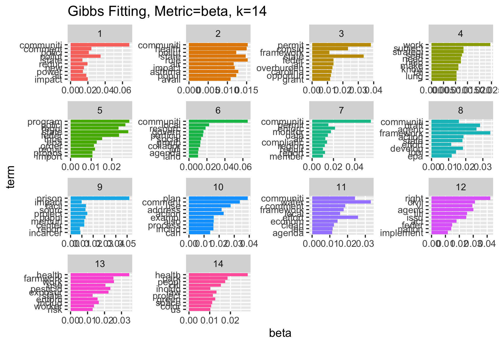

```{r setup, include=FALSE}
knitr::opts_chunk$set(echo = TRUE)

library(here)
library(pdftools)
library(quanteda)
library(tm)
library(topicmodels)
library(ldatuning)
library(tidyverse)
library(tidytext)
library(reshape2)
```

Load the data


```{r data}

comments_df <- read_csv("https://raw.githubusercontent.com/MaRo406/EDS_231-text-sentiment/main/dat/comments_df.csv")
#comments_df <- read_csv(here("dat", "comments_df.csv")) #if reading from local
```

Now we'll build and clean the corpus

```{r corpus}
epa_corp <- corpus(x = comments_df, text_field = "text")
epa_corp.stats <- summary(epa_corp)
head(epa_corp.stats, n = 25)
toks <- tokens(epa_corp, remove_punct = TRUE, remove_numbers = TRUE)

# project-specific stop words
add_stops <- c(stopwords("en"),"environmental", "justice", "ej", "epa", "public", "comment")
toks1 <- tokens_select(toks, pattern = add_stops, selection = "remove")
```

And now convert to a document-feature matrix

```{r dfm}
dfm_comm<- dfm(toks1, tolower = TRUE)
dfm <- dfm_wordstem(dfm_comm)
dfm <- dfm_trim(dfm, min_docfreq = 2) #remove terms only appearing in one doc (min_termfreq = 10)
print(head(dfm))
#remove rows (docs) with all zeros
sel_idx <- slam::row_sums(dfm) > 0 
dfm <- dfm[sel_idx, ]
#comments_df <- dfm[sel_idx, ]
```

# Testing for Ideal `k`

We somehow have to come up with a value for k,the number of latent topics present in the data. How do we do this? There are multiple methods. Let's use what we already know about the data to inform a prediction. The EPA has 9 priority areas: Rulemaking, Permitting, Compliance and Enforcement, Science, States and Local Governments, Federal Agencies, Community-based Work, Tribes and Indigenous People, National Measures. Maybe the comments correspond to those areas?

```{r LDA_modeling}
set.seed(25)
k <- 9 
topicModel_k9 <- LDA(dfm, k, method="Gibbs", control=list(iter = 500, verbose = 25))
#nTerms(dfm_comm) 
tmResult <- posterior(topicModel_k9)
attributes(tmResult)
#nTerms(dfm_comm)   
beta <- tmResult$terms   # get beta from results
dim(beta)                # K distributions over nTerms(DTM) terms# lengthOfVocab
terms(topicModel_k9, 10)
```

# Variation in Metrics

```{r}
# In class metrics
result <- FindTopicsNumber(
  dfm,
  topics = seq(from = 2, to = 20, by = 1),
  metrics = c("CaoJuan2009",  "Deveaud2014"),
  method = "Gibbs",
  control = list(seed = 77),
  verbose = TRUE
)

# Griffiths/Arun
GA_topick <- FindTopicsNumber(
  dfm,
  topics = seq(from = 2, to = 20, by = 1),
  metrics = c("Griffiths2004",  "Arun2010"),
  method = "Gibbs",
  control = list(seed = 77),
  verbose = TRUE
)

FindTopicsNumber_plot(result)
FindTopicsNumber_plot(GA_topick)
```

All metrics other than `Deveaud2014` are optimized by adding more and more topics. However, both `Deveaud2014` and `Griffiths2004` show a noticeable jump at 14. Based on this, additional models are run with 5, 10, and 14 topics.

```{r}
set.seed(25)
k <- 14
topicModel_k7 <- LDA(dfm, k, method="Gibbs", control=list(iter = 500, verbose = 25))
tmResult <- posterior(topicModel_k7)
terms(topicModel_k7, 10)
theta <- tmResult$topics
beta <- tmResult$terms
vocab <- (colnames(beta))


comment_topics <- tidy(topicModel_k7, matrix = "beta")
top_terms <- comment_topics %>%
  group_by(topic) %>%
  top_n(10, beta) %>%
  ungroup() %>%
  arrange(topic, -beta)
top_terms

top_terms %>%
  mutate(term = reorder(term, beta)) %>%
  ggplot(aes(term, beta, fill = factor(topic))) +
  geom_col(show.legend = FALSE) +
  facet_wrap(~ topic, scales = "free") +
  coord_flip() +
  ggtitle(label = "Gibbs Fitting, Metric=beta, k=14")

ggsave(path = here("plots"), filename = "topics14.png")
```

## 5 Topics:


## 7 Topics:


## 10 Topics:


## 14 Topics:


Based on the distribution and overlap in these numbers of topics, I think I would choose either 5 or 10 topics depending on the audience. For a general audience, 5 topics is plenty to highlight the general areas of discussion in the documents: pollution/health, state and federal efforts, enforcement and monitoring, local planning, and title vi/civil rights. However, for a more technical or detailed audience, the 10 topic model splits into more detail while retaining enough distinction and meaning between topics (that, for example, the 14 topic model fails to achieve) that they can be useful categories.

# Variation in Fitting Method

```{r LDA_again}
# Gibbs fitting method

set.seed(25)
k <- 7
topicModel_k7 <- LDA(dfm, k, method="Gibbs", control=list(iter = 500, verbose = 25))
tmResult <- posterior(topicModel_k7)
terms(topicModel_k7, 10)
theta <- tmResult$topics
beta <- tmResult$terms
vocab <- (colnames(beta))


# VEM fitting method

tModel_k7_vem <- LDA(dfm, k, method= "VEM")
tmResult_vem <- posterior(tModel_k7_vem)
terms(tModel_k7_vem, 10)
theta_v <- tmResult_vem$topics
beta_v <- tmResult_vem$terms
vocab_v <- (colnames(beta_v))
```

There are multiple proposed methods for how to measure the best k value.

```{r top_terms_topic}
comment_topics <- tidy(topicModel_k7, matrix = "beta")
top_terms <- comment_topics %>%
  group_by(topic) %>%
  top_n(10, beta) %>%
  ungroup() %>%
  arrange(topic, -beta)
top_terms


# for VEM fitting (note prison stuff)

ct_vem <- tidy(tModel_k7_vem, matrix = "beta")
top_terms_v <- ct_vem %>%
  group_by(topic) %>%
  top_n(10, beta) %>%
  ungroup() %>%
  arrange(topic, -beta)
top_terms_v
```

```{r plot_top_terms}
top_terms %>%
  mutate(term = reorder(term, beta)) %>%
  ggplot(aes(term, beta, fill = factor(topic))) +
  geom_col(show.legend = FALSE) +
  facet_wrap(~ topic, scales = "free") +
  coord_flip() +
  ggtitle(label = "Gibbs Fitting")

top_terms_v %>%
  mutate(term = reorder(term, beta)) %>%
  ggplot(aes(term, beta, fill = factor(topic))) +
  geom_col(show.legend = FALSE) +
  facet_wrap(~ topic, scales = "free") +
  coord_flip() +
  ggtitle(label = "VEM Fitting")
```

Based on a comparison of the top terms in each topic (7 topics) using `Gibbs` and `VEM` fitting methods, it seems like `Gibbs` provides more useful separations (note, for example, that `VEM`lists the term 'communiti'[es] in the top 10 terms in every group, so distinctiveness is not very high). This is using the `beta` metric.
